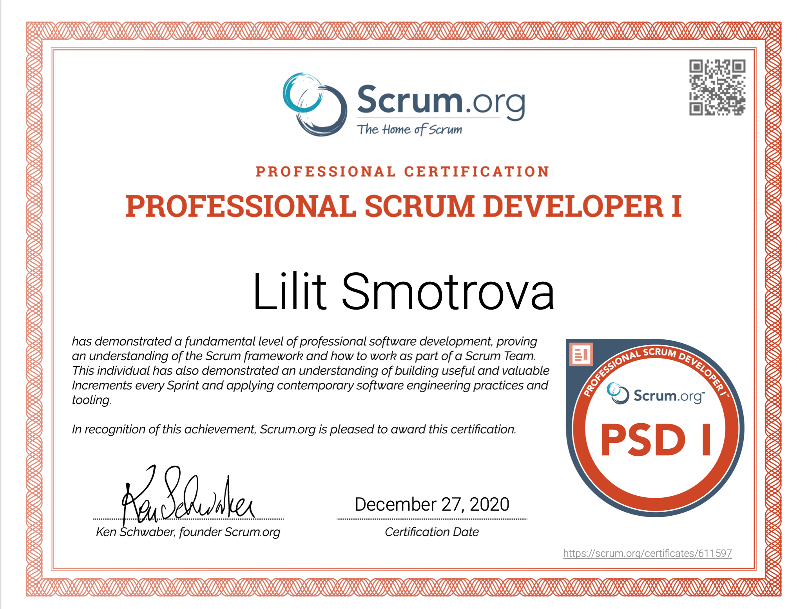

### Hi there 👋

<!--
**SmotrovaLilit/SmotrovaLilit** is a ✨ _special_ ✨ repository because its `README.md` (this file) appears on your GitHub profile.

Here are some ideas to get you started:

- 🔭 I’m currently working on ...
- 🌱 I’m currently learning ...
- 👯 I’m looking to collaborate on ...
- 🤔 I’m looking for help with ...
- 💬 Ask me about ...
- 📫 How to reach me: ...
- 😄 Pronouns: ...
- ⚡ Fun fact: ...
-->

I'm a Software Engineer with 9 years of industry experience, spending the last 3.5 years specializing in the development of secure enterprise systems.

💡 I'm passionate about problem-solving, troubleshooting, exploring novel technologies, and taking on new challenges.

📫 How to reach me: [smotrovalilit@gmail.com](mailto:smotrovalilit@gmail.com) or telegram https://www.linkedin.com/in/smotrovalilit/

⚡ Fun fact: I'm a dedicated fan of 'Souls-like' games. I enjoy the challenging gameplay and the satisfaction of overcoming tough obstacles.
## Certificates

## Code Examples
 | [DDD](https://github.com/SmotrovaLilit/golang-reference-application) | 
  [Tic Tac Toe](https://github.com/SmotrovaLilit/tictactoe) | 
  [Algorithms](https://github.com/SmotrovaLilit/kata) |
  [Go samples](https://github.com/SmotrovaLilit/go-samples) |

## Tools
 | [Testing CORS behaviour](https://github.com/SmotrovaLilit/cors-sandbox) | 
  [Testing differences in DBMS-s](https://github.com/SmotrovaLilit/sql-sandbox) |

